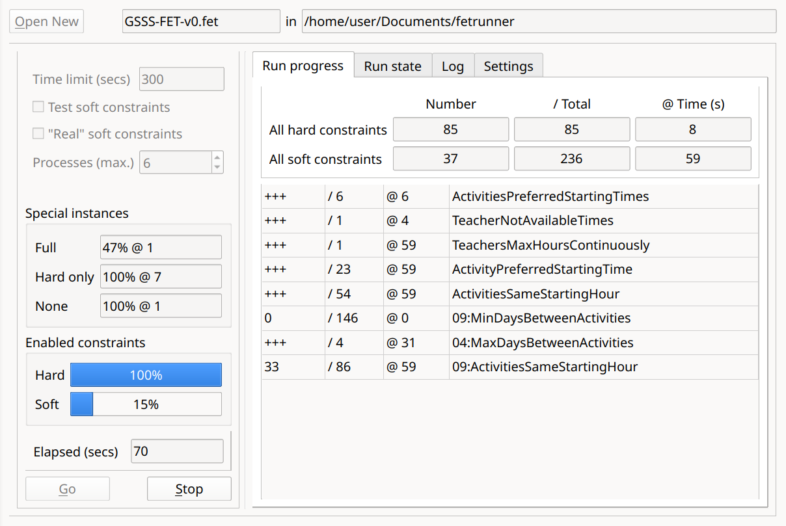

# fetrunner

This is primarily a tool for testing `FET` files. It runs multiple instances of `FET` (the command-line version) on a supplied `FET` file with various subsets of the constraints enabled. The aim is to assist in finding difficult (or impossible) constraints. In order to function as intended it needs to be able to run several processes in parallel – it should work with four processor cores, but better results are likely with at least six.



## `FET`

[`FET`](https://lalescu.ro/liviu/fet/) is a free timetable generator program for educational establishments. It is widely used and very good at what it does. However, in the case of timetable data which "doesn't work" (because of conflicting constraints), it can sometimes be difficult to find where the problem lies. Also, with some data (lessons/activities and constraints) the calculation of a "solution" (a conflict-free timetable) can take a very long time. Whilst working on a timetable, it can be useful to know which constraints may be difficult to fulfil, without waiting a long time for `fet` to complete (or not ...).

`fetrunner` aims to produce a "solution" within a specified time, if necessary by deactivating some of the constraints. The result is a "known working" `FET` file (possibly including deactivated constraints). There is also a log file, which is updated continually during the process, showing some details of the progress, and a JSON file containing the activity placements from the "successful" `FET` run together with information about the "failed" constraints. In the GUI version of `fetrunner`, the log is not output as a file, but is used to update the interface (and is also available to view, if desired).

## How `fetrunner` works

The basic idea is to behave similarly to a person looking for possible problems in a `FET` file. Initially, three instances are run:

 - fully constrained
 - all the hard constraints, but no soft constraints
 - unconstrained

Under normal circumstances these instances run until they complete naturally.

The constraints are divided into types and hard/soft collections.
Normally, the unconstrained instance will complete very quickly. When it does, further `FET` instances are added to a queue, one instance for each hard constraint type (regardless of how many constraints of this type there are). These instances will be run when processor cores are available.

When one of these instances completes, all the others are terminated and a new cycle is begun, taking the successfully completed instance as a new base for further `FET` instances, one for each of the remaining constraint types. Instances with constraints which are easily satisfied are favoured, timeouts are used to catch difficult constraints. In this way it should be possible to include as many constraints as possible within a limited time.

If an instance is timed out (or fails for some other reason), its list of added constraints will be split into two and new `FET` instances will be started for these.

With each successful run contributing its set of constraints to the new runs, there is always a "best so far" `FET` instance, which gradually gathers more and more constraints (ideally!).

Only when all the hard constraints have been successfully included (either via the basic hard-only instance or as the result of gradual accumulation of the constraint-type sets) are the soft constraints added, using the same algorithm.

When the time limit for the program is reached, or when it is manually interrupted, the latest successful run is taken as the result.

There are some difficult cases with which `fetrunner` can't help much, because the basic runs take too long, but for many `FET` files it can provide some useful information.

## Temporary files

`fetrunner` starts many `FET` (`fet-cl`) instances, each of which produces a number of output files. Only a fraction of these are needed by `fetrunner`, and none of them are retained. To reduce wear on SSD storage, these should probably be stored in an in-memory file system (RAM-disk, etc.). Linux has such a file-system "built-in" (at `/dev/shm`), and `fetrunner` uses it for these temporary files. On other operating systems it may be possible to provide something like this, but perhaps only with third-party software.

There are a number of utilities for Windows which can generate RAM-disks. Two free ones which seem to work are [AIMtk](https://sourceforge.net/projects/aim-toolkit) and [OSFMount](https://www.osforensics.com/tools/mount-disk-images.html). Of these OSFMount seems a bit easier to use, but AIMtk can produce a dynamic RAM-disk which only occupies as much memory as is needed – OSFMount allocates a fixed-size block of RAM. However, `fetrunner` would normally need relatively little space, and a few hundred megabytes should be more than enough. When `fetrunner` starts it looks for a drive mounted at "R:", so if possible a RAM-disk should be mounted here.

If no such file-system is available and detected, the standard temporary directory for the operating system will be used. With the command-line version of `fetrunner`, it is possible to specify the path to the directory to be used for temporary files using the "-tmp" option. If a Windows system has a RAM-disk mounted at "M:", the option would then be `-tmp M:\`. In the GUI version of `fetrunner` the path is shown and can be changed on the "Settings" tab.

Within this temporary folder, each run of `fet-cl` gets its own sub-directory for its files. The name of this sub-directory is derived from the source file by removing the extension. If multiple instances of `fetrunner` are to be run simultaneously – which is generally inadvisable because of the limited processor cores – each must have a unique source file name.

## Getting `fetrunner`

There are binary packages on the "Releases" page. These need to be unpacked in the root folder of a recent `FET` installation.

**Important Note for Windows**

On Windows, `fetrunner-gui` needs a special build of the `FET` command-line program. It can't use `fet-cl.exe`, as that would pop up a console window every time it was run (and that would be a *lot* of console windows ...).

The binary package for Windows contains the necessary `fet-clw.exe` program, but it may not match the version of your `FET` installation. If you need a newer `FET` feature, you may need to [recompile it](#special-fet-command-line-program-for-windows).

Note that `fet-clw.exe` is not my software and has a different, more restrictive license: AGPL Version 3. This usage is perhaps not strictly in compliance with the license, but it is used here with the agreement of its author. For further details, source code, etc. see the [FET website](https://lalescu.ro/liviu/fet/).

## Command line / program library / GUI

`fetrunner` started life as a command-line tool, written in `Go`. Subsequently `libfetrunner` was added, which makes the functionality available as a program library (C library, shared or static), using simple JSON structures for communication. There is also a GUI, written in `C++/Qt`, which uses `libfetrunner` as its back-end.

For usage information, including help with interpreting the results of a `fetrunner` run, see [Using `fetrunner`](./docs/using_fetrunner.md).

### Building the command-line tool

`fetrunner`, being written in `Go`, should be very portable. I have tested it on Linux and briefly on Windows, but it should also work on MacOS. To compile it, run this in the base directory (assuming the Go compiler has been installed!):

```
go build ./cmd/fetrunner
```

An executable should be produced in the same directory.

### Building the program library

See [Build `libfetrunner`](./libfetrunner/README.md).

### Building the GUI

As this is written in `C++` this is more difficult. The recommended approach is to use the Qt libraries from the `FET` binary installation which will be used by `fetrunner`. This should work if the `FET` binary installation uses a Qt version equal to or newer than that with which `fetrunner` is compiled.

The following instructions assume you are using the Qt development kit from the [Qt website](https://www.qt.io/development/download-qt-installer-oss), installed to the standard location.

 1) Compile `libfetrunner` as a [*static* library](./libfetrunner/README.md).

 2) Make a new directory `build` in the `fetrunner/gui` directory.

 3) Open the terminal (Linux) or Powershell (Windows) in this `build` directory.

 4) Compilation and "installation" is then platform-dependent.

#### Compilation on Linux

```
$HOME/Qt/Tools/CMake/bin/cmake .. -DCMAKE_PREFIX_PATH=$HOME/Qt/6.10.1/gcc_64 -DCMAKE_INSTALL_PREFIX=install

$HOME/Qt/Tools/CMake/bin/cmake --build . --target install -j 4
```

Copy the resulting `fetrunner-gui` executable from `install/bin` to the `bin` directory of your `FET` installation.

Optionally copy the `icons` directory from `fetrunner\gui` to  the `bin` directory of your `FET` installation.

#### Compilation on Windows

```
C:\Qt\Tools\CMake_64\bin\cmake.exe .. -DCMAKE_PREFIX_PATH=C:\Qt\6.10.1\mingw_64 -DCMAKE_GENERATOR="MinGW Makefiles"

C:\Qt\Tools\CMake_64\bin\cmake.exe --build . -j 4
```

Copy the resulting `fetrunner-gui.exe` executable from `build` to the root directory of your `FET` installation.

Optionally copy the `icons` directory from `fetrunner\gui` to  the root directory of your `FET` installation.

#### Special `FET` command-line program for Windows

To build the necessary `fet-clw.exe` program you need to download the `FET` source package and unpack this somewhere convenient.

 - Make a new directory, `build-clw`, in the root directory of the `FET` source code.

 -  Open `Powershell` in this `build-clw` directory.

 - Compile:

```
C:\Qt\Tools\CMake_64\bin\cmake.exe .. -DCMAKE_PREFIX_PATH=C:\Qt\6.10.1\mingw_64 -DCMAKE_GENERATOR="MinGW Makefiles" -DCOMMAND_LINE_ONLY=ON -DNO_WINDOWS_CONSOLE=ON

C:\Qt\Tools\CMake_64\bin\cmake.exe --build . -j 4
```
 - Copy the resulting `fet-clw.exe` executable from `build` to the root directory of your `FET` installation.
