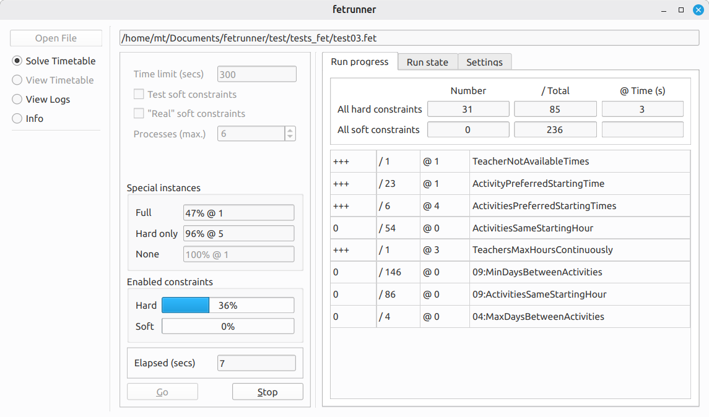

# Introducing `fetrunner`

Given a `FET` file, `fetrunner` aims to produce a "solution" (a timetable without placement conflicts) within a specified time, if necessary by deactivating some of the constraints. Thus it can be help to find difficult (or potentially impossible) constraints.

[`FET`](https://lalescu.ro/liviu/fet/) is a free timetable generator program for educational establishments. It is widely used and very good at what it does. However, in the case of timetable data which "doesn't work" (because of conflicting constraints), it can sometimes be difficult to find where the problem lies. Also, with some data (lessons/activities and constraints) the calculation of a "solution" (a conflict-free timetable) can take a very long time. Whilst working on a timetable, it can be useful to know which constraints may be difficult to fulfil, without waiting a long time for `FET` to complete (or not ...).

`fetrunner` can be run as a command-line program, but there is also a convenient GUI version which shows how a run is progressing and can also display the resulting timetables.



The result of a `fetrunner` run is a "known working" `FET` file (where some of the constraints might have been deactivated) and a JSON file containing the activity placements from the "successful" `FET` run together with information about the "failed" constraints. The command-line `fetrunner` also produces a log file, which is updated continually during the process, showing some details of the progress. In the GUI version, the log is not output as a file, but is used to update the interface (and is also available to view, if desired).

In order to function as intended `fetrunner` needs to be able to run several processes in parallel – it should work with four processor cores, but better results are likely with at least six.

## Not running on Linux?

`fetrunner` produces many temporary files, which might cause excessive wear on an SSD. This should not be such a problem on Linux, because `fetrunner` uses the in-memory filesystem at `/dev/shm` for these temporary files by default. See [Temporary files](./temporary_files.md) for ways to avoid this on other operating systems.

## Important Note for Windows

On Windows the GUI version, `fetrunner-gui`, needs a special build of the `FET` command-line program. It can't use `fet-cl.exe`, as that would pop up a console window every time it was run (and that would be a *lot* of console windows ...).

The `fetrunner` binary package for Windows contains the necessary `fet-clw.exe` program, but it may not match the version of your `FET` installation. If you need a newer `FET` feature, you may need to [recompile it](./windows_fet_clw.md).

Note that `fet-clw.exe` is not my software and has a different, more restrictive licence: AGPL Version 3. I am not sure whether this usage is strictly in compliance with the licence, but it is used here with the agreement of its author. For further details, source code, etc. see the [FET website](https://lalescu.ro/liviu/fet/).

## Command line / program library / GUI

`fetrunner` started life as a command-line tool, written in `Go`. Subsequently `libfetrunner` was added, which makes the functionality available as a program library (C library, shared or static), using simple string structures for communication. A GUI version followed, written in `C++/Qt`, which uses `libfetrunner` as its back-end.

For usage information, including help with interpreting the results of a `fetrunner` run, see [Using `fetrunner`](./using_fetrunner.md).

### Building the command-line tool

`fetrunner`, being written in `Go`, should be very portable. I have tested it on Linux and briefly on Windows, but it should also work on MacOS. To compile it, run this in the base directory (assuming the Go compiler has been installed!):

```
go build ./cmd/fetrunner
```

An executable should be produced in the current directory.

### Building the program library

This use `CGO` and thus requires a C-compiler for the target platform. See [Build `libfetrunner`](./libfetrunner-compile.md) for details.

### Building the GUI

As this is written in `C++` it is more difficult. See [Build GUI](./gui-build.md).
