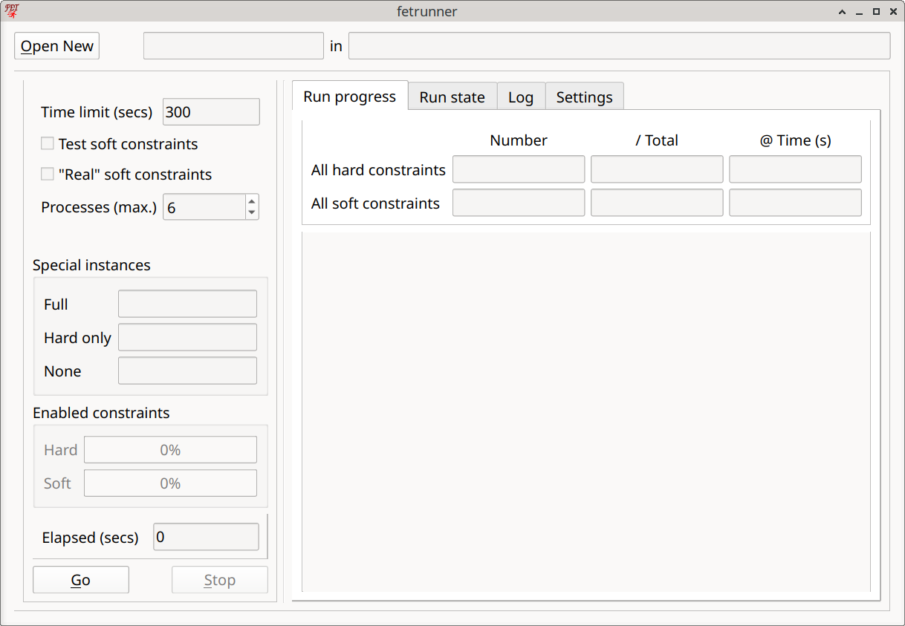
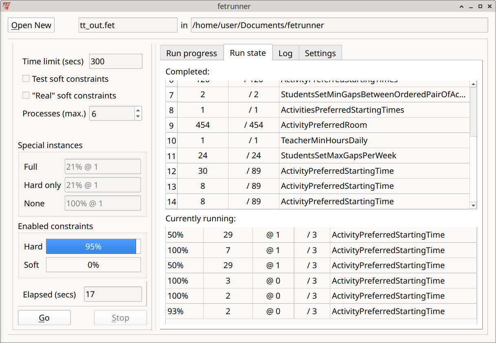
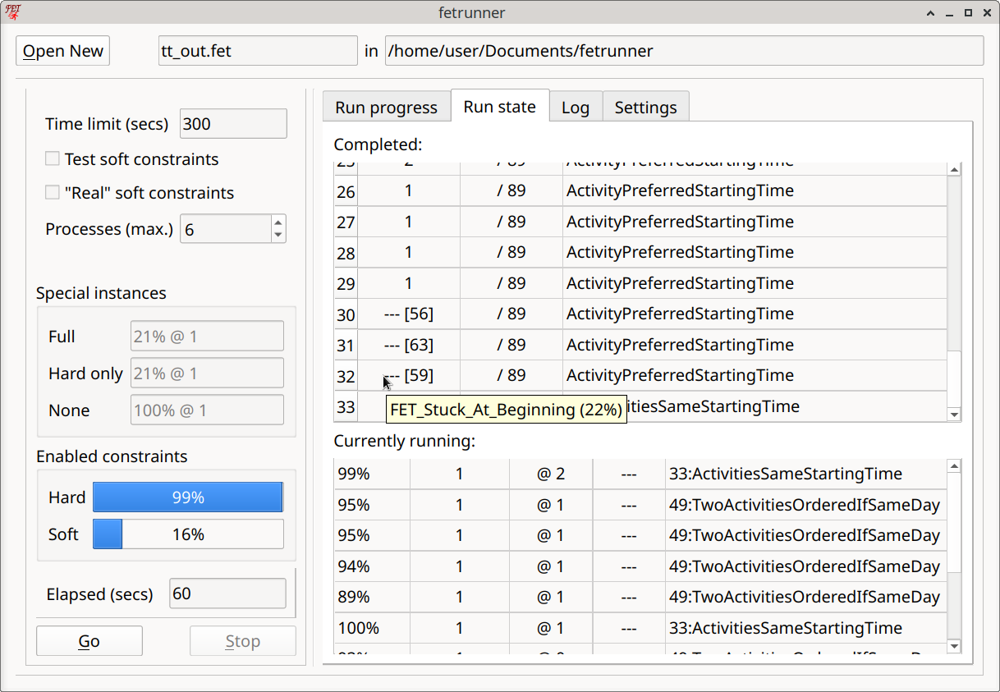
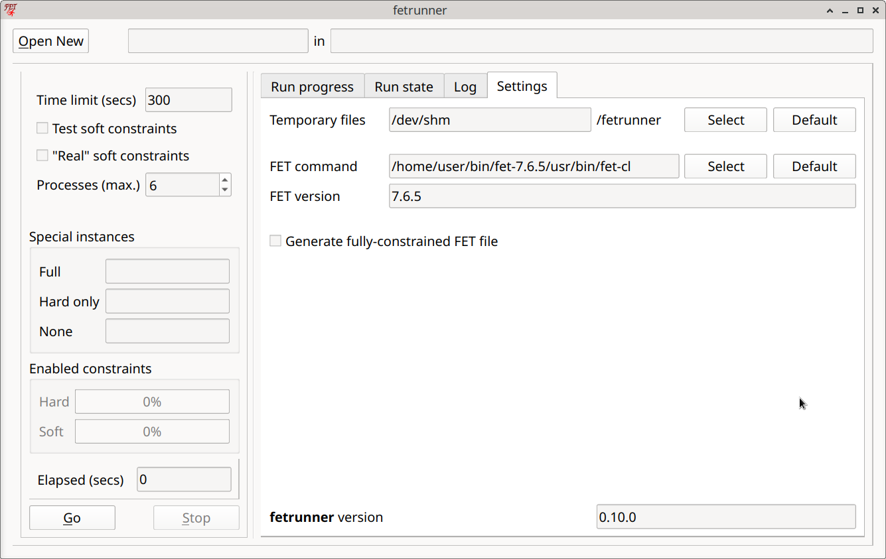

# Using the GUI

The `fetrunner` GUI offers a convenient way of using `fetrunner`, allowing files to be loaded, parameters to be set and runs to be initiated. When a `fetrunner` process is running, the GUI provides various views on to the state and progress of the run.

To exit the program, click on the window-close button. If a `fetrunner` process is running, `fetrunner` will take a few seconds to tidy up before quitting completely.

## The display areas

At the top of the window the currently loaded source file is shown, split into file name and folder. There is also a button to load a different one.

Below this, there are two panels:

### The left panel

At the top a few of the most useful parameters are shown and can be changed.

#### Parameters

 - Time limit: When a run reaches this elapsed time, it will be aborted. The latest successful `FET` instance will be taken as the result.

 - Test soft constraints: Ticking this box will include all hard constraints as the basis for every `FET` instance, the two special instances with no constraints and only hard constraints will not be run. It is intended for cases where the hard constraints are known to be OK and we want to concentrate on the soft constraints.

 - "Real" soft constraints: Retain the original weights of the soft constraints. Otherwise they are made "hard" for the `FET` runs. 

 - Processes (max.): The maximum number of `FET` instances that may be run simultaneously. 6 seems to be a good number, if that number of processor cores are available. More might be wasteful of resources and not necessarily more effective. Fewer than 4 won't allow the algorithm to work properly. If the host computer doesn't have 4 cores, the number of processes should still be set to 4, but `fetrunner` will be much less effective.

The items below this only become relevant when a file has been loaded and a run started.

Below this the progress of the three "special" instances (`FET` processes) are shown. Note that if the "Test soft constraints" checkbox is ticked, only the "Full" instance is active.

The next area, "Enabled constraints" shows the progress of the tests with single constraint types, that is, the increasing number of constraints which have been found to be fulfillable. It displays the same information as the panel at the top of the "Run progress" view, but in a different form.

Then comes the "Elapsed time" counter, showing the number of seconds for which a run has been active.

Finally there are the run controls. Here you can start, and also interrupt, a run. Stopping a run has the same effect as reaching the time limit: it will take a couple of seconds to become effective because it tidies up the running processes and collects the latest results.

### The right panel

This contains several panels selected by tabs.

#### Tab: Run progress

Here all the constraint types used in the source file are shown in a table. Above the table there are lines to display the total progress of all hard and all soft constraints (number of "accepted" constraints). In the table, the constraint types are placed in the last column because this is easier (and I think neater) to lay out.

Note that for soft constraints, the constraint type is prefixed by "nn:", where "nn" is a number between "00" and "99" related to (but not the same as) the `FET` percentage weight.

The numeric columns display (for the associated constraint type):

	1) the number of "accepted" constraints;
	
	2) the total number of individual constraints;
	
	3) the elapsed time at which the number field was last changed.
	
When all the individual constraints of a type have been "accepted" (found to be fulfillable), the number is replaced by "+++".
 
#### Tab: Run state

On this page there are two tables. At the top, all the single-constraint-type `FET` instances are shown which completed successfully _and_ which were "accepted", i.e. whose constraints have been added to the running collection.

The numeric columns display (for the associated constraint type):

	1) a simple line number, showing acceptance order;

    2) the number of individual constraints being tested in this instance;

    3) the total number of individual constraints;

This table also shows single constraints which have been "rejected" (because they may be impossible), as can be seen in the following screenshot:

Instead of the number of constraints, "--- [n]" is shown. The number in square brackets is the index given to the rejected constraint in the "xxx_Result.fet" file produced by this run. This should help to find exactly which constraint this line refers to. These entries also have a tool-tip, which can indicate why the constraint was rejected.

At the bottom of the page, the currently running instances are shown together with their progress (in percent) (excluding the "special" instances). Many of these will be terminated before completion. Even if one reaches 100%, it will only be "accepted" (and this transferred to the upper table) if it is the first one in the current group to do so.

The numeric columns display (for the associated constraint type):

	1) the completion percentage of the `FET` process;
	
	2) the total number of individual constraints;
	
	3) the process run time at which the last progress change was recorded;

    4) the time-out for this process (note that this is handled very flexibly!).

Constraint groups with only one constraint are run without a time-out (shown as "---"), but they may still be terminated if they seem to be "stuck".

#### Tab: Log

This view is probably of little interest to the normal user. It shows the communication between the GUI and the back-end processor.

#### Tab: Settings

This gives access to some settings which will not normally be needed, except perhaps for initial set-up.

 - Temporary files: `fetrunner` produces many temporary files, arising from the many calls to the `FET` command-line program. If possible, these will be saved in an in-memory file-system. See [Temporary files](../README.md#temporary-files) for further details.

 - Fet command: This shows the command used to run the `FET`command-line program. It may be necessary to change this occasionally (after an update, for example), or there may be multiple versions available on the machine. You can select the one used here. Clicking "Default" will try to restore the default value (in the same folder as the ``fetrunner` executable, or else in the systems standard "PATH").
 
 - Fet version: The version of the selected `FET` program will be shown here.

 - Generate fully constrained FET file. This causes a slightly modified version of the original `FET` file to be written to the folder containing the source file. It is given a "_" prefix and contains some additional information added by `fetrunner`. Unless the "Real" soft constraints option is set, any soft constraints will now have "Weight_Percentage" 100, i.e. have become "hard". The original weight is added to the "Comments" field, along with a constraint index.

Also the `fetrunner` version is shown.
